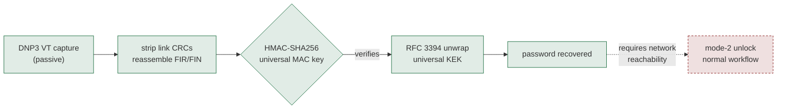
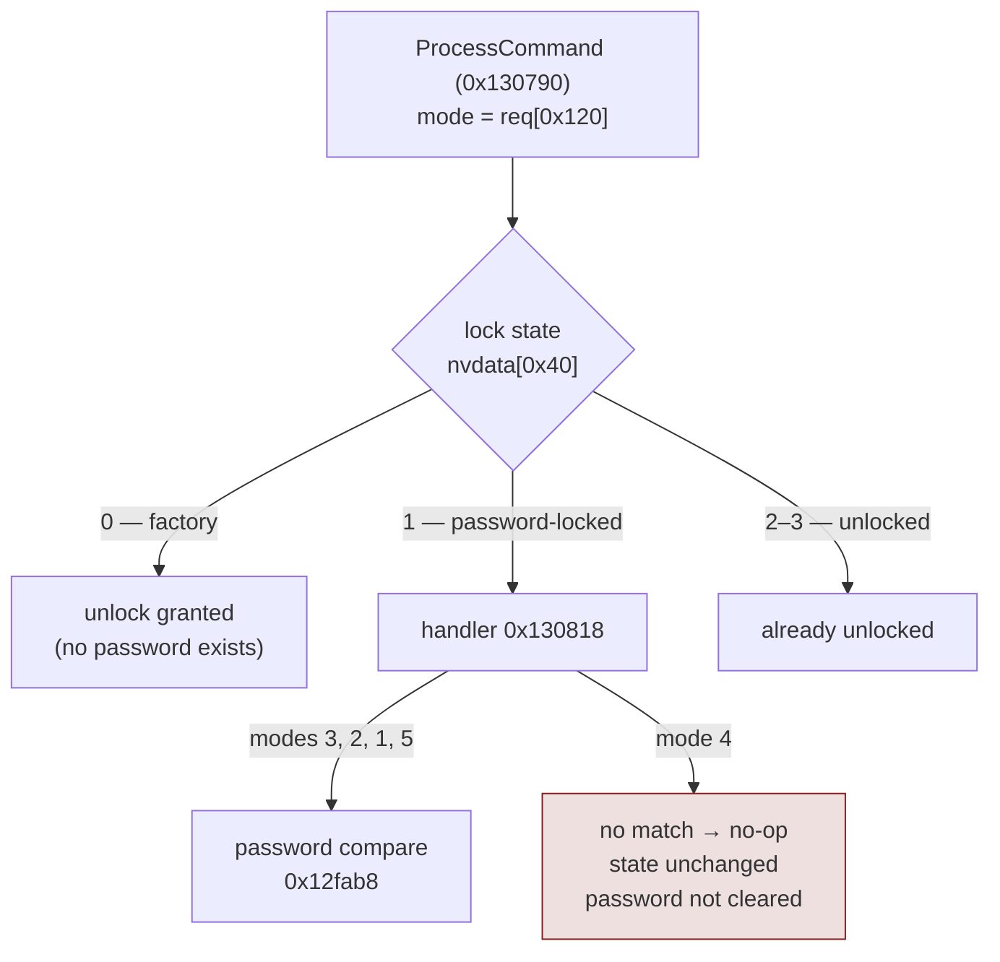

## Summary

**Anyone who captures a SCADAPack x70 password being set, changed, or used to unlock can recover it.** The exchange is protected with an AES-128 KEK derived
from compiled-in constants that are identical in the Windows configuration tool
and RTU firmware. Decryption is offline and takes no guessing.

The password gates configuration writes, command execution, firmware upgrade,
security settings, file write and FTP/Telnet access on the device. Recovering it
gives an attacker the credential for the product's normal unlock workflow.

Schneider describes Secure Lock as legacy functionality retained for backward
compatibility and recommends using RBAC in its place on supported SCADAPack
devices.

Secure Lock is Schneider Electric's device-locking feature for the SCADAPack x70,
a remote terminal unit used in pipeline, water and oilfield sites. Its messages —
lock, unlock, set password, change password — travel over the **DNP3 Virtual
Terminal**, wrapped in AES-128 RFC 3394 key wrap with an HMAC-SHA256 MAC. The
algorithms are sound; the keys are not. Neither key derivation takes a per-device,
per-session or per-installation input, so every unit running the tested build uses
the same two keys.

```text
HMAC-SHA256 MAC key : 9fxx9xx401
AES-128 KEK         : cdxx9xx74a
```

The sanitized verifier is published at
**[github.com/abhinavagarwal07/scadapack-secure-lock-poc](https://github.com/abhinavagarwal07/scadapack-secure-lock-poc)**.

> **Affected:** the SCADAPack x70 Device DTM 2.0.18103.4 (RemoteConnect R3.5.5)
> and the `9135e47x.fwz` firmware image I tested, in password-mode (non-RBAC)
> deployments. Exact hashes and the limits of that claim are in
> [Affected and not established](#affected-and-not-established).

> **Disclosure:** Reported to Schneider Electric and published as
> **[SEVD-2026-251-03](https://download.se.com/files?p_Doc_Ref=SEVD-2026-251-03&p_enDocType=Security+and+Safety+Notice&p_File_Name=SEVD-2026-251-03.pdf)**;
> assigned **[CVE-2026-81861](https://www.cve.org/CVERecord?id=CVE-2026-81861)**.
> CISA advisory **ICSA-26-258-04** is tentatively scheduled for publication on
> 2026-09-15.

---

## Impact

| Claim | Status | Basis |
|-------|--------|-------|
| The two keys are universal within the tested builds | **Confirmed** | All four constants extracted from the DTM DLL *and* the firmware image; both independently re-derive identical keys |
| The vendor's own code derives the same two keys | **Confirmed by execution** | Reflected into the DTM's private `MakeSHA256Key()`/`MakeAESKey()`; both returned the documented values |
| Password recovery from a **vendor-built** message | **Confirmed** | The DTM's own `InitializeLockRequestMessage` produced a complete message; the private research PoC recovered both passwords from it |
| The private research key wrap matches the vendor's | **Confirmed** | Vendor `KeyWrapAlgorithm.WrapKey()` and the private research implementation's `rfc3394.wrap()` produce byte-identical ciphertext, and each unwraps the other's |
| Forged no-password unlock (mode 4) against a locked device | **Refuted** | Firmware dispatcher reaches a no-op; confirmed statically and by emulation |

The result is password disclosure, not a passwordless bypass; the forged-unlock
path was tested and refuted (see
[Mode 4 does not bypass the password](#mode-4-does-not-bypass-the-password)).



Legend: `Solid path: confirmed offline. Dashed step: requires network reachability and live-device validation.`

The password crosses the wire during ordinary unlock and relock operations as
well as password set/change operations. What the recovered password then yields
depends on network reachability, enabled services and device configuration.

There is no per-device work factor — the constants are extracted once. Rotating
the device password does not help, because the rotation is itself the exchange
that leaks. Because the keys are in the firmware as well as the tool, remediation needs
coordinated firmware and DTM changes; changing only the Windows-side key breaks
interoperability.

---

## Context and prior art

The SCADAPack x70 is Schneider's RTU/rPAC family for distributed field sites,
marketed for "oil and gas production, water and wastewater facilities, and energy
infrastructure." [RemoteConnect](https://img.wwdmag.com/files/base/ebm/wwdmag/document/2022/06/1655328571127-schneider_electric_remoteconnect_for_scadapack_x70_rtus_brochure.pdf)
configures the range over FDT2/DTM; the SCADAPack x70 Device DTM is the plug-in
that manages the RTU, speaks Secure Lock and carries the keys. It is the standard
configuration path for the line.

I found no prior public CVE or advisory covering Secure Lock. Schneider's advisory now lists the older 32/3xx line, which I did not examine, as affected.

Hard-coded keys are a recurring ICS finding — Siemens LOGO! Soft Comfort
([ICSA-26-225-13](https://www.cisa.gov/news-events/ics-advisories/icsa-26-225-13)),
Moxa switches ([ICSA-20-056-03](https://www.cisa.gov/news-events/ics-advisories/icsa-20-056-03),
[ICSA-20-056-04](https://www.cisa.gov/news-events/ics-advisories/icsa-20-056-04)),
Rockwell ISaGRAF
([KLCERT-20-025](https://ics-cert.kaspersky.com/vulnerabilities/klcert-20-025-rockwell-automation-isagraf-runtime-information-disclosure-due-to-hard-coded-cryptographic-key/)).

---

## What Secure Lock is

Secure Lock is separate from DNP3 Secure Authentication (SAv2/SAv5, IEEE 1815):
it is a self-contained password protocol over the DNP3 Virtual Terminal, using
its own constant key material rather than SAv2's Update Key.

The DTM's enums show the design intent:

```csharp
public enum SecureLockKeyMethod           { PreSharedKey }               // one value
public enum SecureLockEncryptionAlgorithm { Aes128 = 1 }                 // one value
public enum SecureLockMacAlgorithm        { Sha256 = 4 }                 // one value
public enum SecureLockDeviceLockMode      { LockPreventConfig = 1, LockUnlock = 2,
                                            LockRelock = 3, UnlockNoPassword = 4,
                                            LockEnterPassword = 5 }
```

`SecureLockKeyMethod` exposes only `PreSharedKey`, and the DTM's status-response
parser reads this value from every successful response. In the tested DTM and firmware that key is not
provisioned per device: both implementations derive it solely from the same
embedded constants, with no device-specific input.

---

## Technical details

### The key derivation

Both keys come from `SecureLockProtocolHelper` in the DTM
(`MakeSHA256Key()` and `MakeAESKey()`), mirrored in firmware by
`CSecureLock::makeSHA256key` (VA `0x12f86c`) and `CSecureLock::makeAESkey`
(VA `0x12f724`). Each is called exactly once, from `CSecureLock::Initialise`
(VA `0x12f9b4`), **with no arguments and no external state**.

The derivation is a small piece of obfuscation rather than a key schedule. Four
64-byte constants — call them A, B, C and D — are combined with XORs, odd-length
truncations and a byte reversal, then run through HMAC-SHA256:

```python
MAC key = HMAC-SHA256( reversed(B),  (A xor C)[:63] || D[:62] )        # 32 bytes
KEK     = HMAC-SHA256( reversed(C),  D[:63] || (A xor B)[:61] )[16:32] # low 16 bytes
```

The truncations are `array6.Length - 1`, `array4.Length - 2` and
`array6.Length - 3`, which appear in the decompiled C# as arbitrary off-by-N
slices. The KEK is the *low* 16 bytes of its own HMAC output; note that the two
derivations use different HMAC keys, so the digest being truncated is not the one
that produces the MAC key.

The derivation is:

```python
import hashlib, hmac
xor = lambda p, q: bytes(a ^ b for a, b in zip(p, q))

mac_key = hmac.new(B[::-1], xor(A, C)[:63] + D[:62],  hashlib.sha256).digest()
kek     = hmac.new(C[::-1], D[:63] + xor(A, B)[:61],  hashlib.sha256).digest()[16:32]

assert mac_key.hex().startswith("9f") and mac_key.hex().endswith("401")
assert kek.hex().startswith("cd") and kek.hex().endswith("74a")
```

No device identity, no session state, no installation secret enters either
computation. Every instance of the tested DTM build and firmware image derives
the same two keys at startup.

### The key is in the firmware too

A key in the Windows tool alone proves nothing about devices. All four constants appear raw and byte-identical in the RTU firmware image—an ARM32 VxWorks binary built with a different architecture and toolchain from the .NET DLL:

| Constant | DTM DLL offset | Firmware image offsets |
|----------|----------------|------------------------|
| A | `0x2dd4d4` | `0x95a570`, `0x95a93c`, `0x95bd88`, `0x95bf8c`, `0x9669a0`, `0x966af0` |
| B | `0x2dd60c` | `0x95a530`, `0x95a8fc`, `0x95bdc8`, `0x95bfcc`, `0x9669e0`, `0x966a70` |
| C | `0x2dd754` | `0x95a4f0`, `0x95bd48`, `0x95bf4c`, `0x966960`, `0x966ab0` |
| D | `0x2dd67c` | `0x95a5b0`, `0x95be08`, `0x95bf0c`, `0x966920`, `0x966a30` |

The firmware load base is `file_offset + 0x100000`, verified through a vtable
self-pointer at file offset `0x95aa20` resolving to VA `0xa5aa74`.

The private research extractor re-derives the keys from whichever binary it is
given, so the binary evidence is independently checkable against files obtained
through authorized channels:

```console
$ ./tools/extract_constants.py Schneider_Electric.SCADAPackRTUDeviceDtm.Dtm.dll
sha256 : c5deb1ab6b4debe7…
constant A : found at 0x2dd4d4
constant B : found at 0x2dd60c
constant C : found at 0x2dd754
constant D : found at 0x2dd67c
re-derived from this binary alone:
  HMAC-SHA256 MAC key : 9fxx9xx401
  AES-128 KEK         : cdxx9xx74a
[+] keys match the expected values

$ ./tools/extract_constants.py vxworks_arm.bin
sha256 : 0c2d2b3fc64672f0…
constant A : found at 0x95a570, 0x95a93c, 0x95bd88, 0x95bf8c, 0x9669a0, 0x966af0
...
[+] keys match the expected values
```

### Message format

From `Dnp3SecureLockingProtocolHandler.InitializeLockRequestMessage`. A
lock-change request is:

```text
off  0   protocol version (1 or 2)
off  1   payload length, little-endian uint16      (= 10 + len(ct) + 16)
off  3   command                                   (0x42 LockStatusChange)
off  4   session id, little-endian uint32
off  8   sequence number, little-endian uint32
off 12   user id
off 13   RFC 3394 wrapped ciphertext
off -16  HMAC-SHA256(MAC key, msg[3 : 13+len(ct)])[:16]
```

and the wrapped plaintext carries the passwords directly:

```text
off  0   lock mode                    (SecureLockDeviceLockMode)
off  1   sequence number, little-endian uint32
off  5   user id
off  6   key method                   (0 = PreSharedKey)
off  7   encryption algorithm         (1 = Aes128)
off  8   lock state
off  9   MAC algorithm                (4 = Sha256)
off 10   challenge length             (32)
off 11   challenge data               (32 bytes)
off 43   current password length, then the password in UTF-8
off ..   new password length, then the password in UTF-8
off ..   random padding to an 8-byte boundary
```

The key wrap is a faithful RFC 3394 implementation — the vendor ships its own
`KeyWrapAlgorithm` class rather than using a platform primitive, with the default
IV `A6xxx` and six rounds, so standard unwrap interoperates with it.
The MAC is HMAC-SHA256 truncated to 16 bytes over the payload header and
ciphertext.

The 32-byte challenge defeats replay. It cannot compensate for a universal key: anyone holding the KEK can read the message, and anyone holding the MAC key can produce a fresh one.


### Decrypting a capture

Because the MAC key is universal, locating Secure Lock traffic in a capture
requires no DNP3 object-header parsing and no protocol-version tracking: slide
over the reassembled stream and keep every offset whose 16-byte HMAC-SHA256
verifies. The universal MAC key acts as a detection oracle with no realistic
false-positive rate.

The one real complication is framing. DNP3 splits a link-frame body into 16-byte
chunks each followed by a CRC, and an application fragment can span several
frames, so a Secure Lock message never sits contiguously in a capture. The tool
strips the link-layer CRCs, reassembles transport segments using the FIR/FIN
bits, and then runs the MAC oracle over the result.

Against the private research PoC's **synthetic, product-format fixture**:

```console
$ python3 securelock_research.py scan capture.pcap
[+] Secure Lock message at offset 7 of 10.20.30.40:51000 > 10.20.30.9:20000 (DNP3 fragment)
  MAC               : 9ce25e1190f0d33a6f3306abb0e8ee47 (valid)
  >> current password : 'Sc@daP@ck-x70'
  >> new password     : 'Wint3r2026!Grid'
```

This exercises the key derivation, DNP3 de-framing, MAC verification and RFC 3394
recovery against a message in the product's format.

---

## Mode 4 does not bypass the password

`UnlockDeviceWithoutPassword` is a real DTM API that builds a valid mode-4
message. I constructed one — 85 bytes, MAC-valid, correctly wrapped — confirming
attacker control of the crypto and framing.

`ProcessCommand` (firmware VA `0x130790`) dispatches on a jump table indexed by
the current lock state in `nvdata[0x40]` (0 factory/no-password, 1
password-locked, 2–3 unlocked), with the mode read from `req[0x120]`. In state 1
the handler at `0x130818` tests only modes 3, 2, 1 and 5. **Mode 4 matches none
and falls through to a no-op:** status stays at its initialisation value,
`SetState` is never called, the password is not cleared, and the comparison at
`0x12fab8` is never reached. The password check is reachable only via mode 2 and
one mode-3 subpath.



Unicorn emulation confirmed that a wrong-password mode-2 request was rejected.
Factory mode 4 unlocks only when no password exists.

---

## Running it against the vendor's own code

A round-trip through this project's own encoder and decoder demonstrates
self-consistency only. To remove that encoder from the proof path, the message was
produced by **Schneider's shipped code** instead.

On an isolated Windows Server 2025 VM, with the hash-verified
`Schneider_Electric.SCADAPackRTUDeviceDtm.Dtm.dll` loaded read-only, compiled
against Framework `csc.exe`:

**1. The vendor's own key derivation.** Reflecting into the private static
`MakeSHA256Key()` and `MakeAESKey()` and printing what they return:

```text
MakeSHA256Key() (MAC key) : 9fxx9xx401
MakeAESKey()    (KEK)     : cdxx9xx74a
MATCH                     : True
```

**2. The vendor's own primitives.** A harness assembled the plaintext and framing
by hand from the decompiled layout and called the vendor's `EncryptData()` and
`ComputeHash()` for the wrap and MAC — *vendor-generated ciphertext and MAC over
researcher-assembled bytes*, which is not the same as a vendor-generated message.
With padding and challenge fixed it is byte-reproducible: two independent runs
produced SHA-256 `4ff2dbf4…`, and the tool recovers both passwords (MAC
`8bb37e6b…`).

**3. The vendor's own message builder.** Using
`FormatterServices.GetUninitializedObject` to sidestep the `DeviceModel`
constructor, populating the private static `_secureLockSession`, and invoking the
protected `InitializeLockRequestMessage` by reflection produced a complete,
vendor-framed Secure Lock message — layout, wrap and MAC all from the DTM. The
richer vendor-message output appears in [Reproducing](#reproducing).

The harness supplied the test session values; the DTM produced the plaintext
layout, ciphertext, MAC and complete framed message. The `8c859bff…` and
`e8667ea9…` pair came from a separate non-determinism check starting from the
pinned `93d5f53f…` artifact; both distinct artifacts recovered correctly. The
vendor's CSPRNG runs per invocation, so the challenge is
fresh per session while the key protecting the password is not.

**4. The key wrap is the same implementation.** Schneider's
`KeyWrapAlgorithm.WrapKey()` and the private research implementation's
`rfc3394.wrap()`, run over the same 32-byte buffer under the real KEK, produce
byte-identical ciphertext, and each side unwraps the other's output.

Both messages ship as regression fixtures in `samples/vendor_generated/`.

---

## Limitations

No physical RTU or live traffic was tested. One captured disposable-password exchange would confirm traffic interoperability, and an authenticated unlock using the recovered password would confirm live impact.

---

## Reproducing

At Schneider's request, I am withholding the operational research PoC from
public release. A sanitized offline fixture verifier accompanies this
disclosure instead. It verifies two SHA-256-pinned messages produced through
Schneider's shipped DTM code paths and has no embedded production keys, network
client, capture scanner, arbitrary-file decryptor, message builder or
device-control function.

A fuller research PoC is available to affected vendors, asset owners and
defenders upon request for authorized validation. I share it privately only after verifying the requester's authorization and need. It can locate and recover
passwords from arbitrary captures and includes an experimental live client for
submitting a recovered password through the normal unlock workflow. For example,
the private research PoC recovered both test passwords from a complete message
generated by Schneider's own DTM message builder:

```console
$ python3 securelock_research.py decrypt --file samples/vendor_generated/vendor_message_s1.bin
  MAC               : 8688b61d39de4ab0dd59e509a25cd241 (valid)
  lock mode         : 1 (LockPreventConfig)
  key method        : 0 (PreSharedKey)
  challenge         : 93d5f53f86e41e835b193e362b74c076e5fab652cb582cda49625d4f830130a2

  >> current password : <recovered correctly>
  >> new password     : <recovered correctly>
```

The public PoC is a bounded offline verifier. It contains AES decryption, RFC
3394 unwrap and digest-gated Secure Lock parsing, but no production key material,
capture processing, message construction, transmission or device-control path.

```bash
# Verify public cryptographic vectors, parser controls and fixture allowlisting
python3 tests/test_vectors.py

# Optionally verify only the two digest-pinned vendor-DTM fixtures using
# production keys obtained independently through authorized access
python3 securelock_poc.py verify-fixtures --key-file /path/to/local-keys.json
```

The default suite runs 11 tests covering public AES/RFC 3394 vectors,
non-production parser controls, malformed lengths and fixture allowlisting. The
vendor-fixture test is skipped unless an authorized local key file is supplied.
The verifier accepts only two named fixtures whose SHA-256 values are compiled
into the tool, verifies the digest before parsing and never prints supplied keys
or recovered passwords.

---

## Affected and not established

**Tested and affected:**

- SCADAPack x70 Device DTM `Schneider_Electric.SCADAPackRTUDeviceDtm.Dtm.dll`
  2.0.18103.4, shipped in RemoteConnect R3.5.5 —
  SHA-256 `c5deb1ab6b4debe77114a6ca8db5a909a50885dfd35cc2222f1a9ee45a6190fc`
- SCADAPack x70 device firmware distributed as `9135e47x.fwz` —
  SHA-256 `d2379adb40d862c170dbe77333f5d2de368ad0b4e2646daa2aa60b10a1d0c233`;
  extracted ARM32 VxWorks image
  SHA-256 `0c2d2b3fc64672f09970ceb8e641f4bab68dd697741244a391fc6b0e230be79f`

Schneider's advisory reports all versions of SCADAPack 47x, 47xi, 47xd, 470R,
57x, 3xx and 32 as affected; that is the vendor-reported scope. I independently
examined only the two binary identities above. Schneider recommends
RBAC instead of Secure Lock on supported 47x/470R devices, and network
segmentation plus the RTU firewall for 57x/3xx/32; see the
[SEVD-2026-251-03 advisory](https://download.se.com/files?p_Doc_Ref=SEVD-2026-251-03&p_enDocType=Security+and+Safety+Notice&p_File_Name=SEVD-2026-251-03.pdf)
for the mitigation guidance.

Scope is password-mode (non-RBAC) deployments; RBAC mode is mutually exclusive
with Secure Lock password mode.

---

## Disclosure timeline

- **2026-07-16:** Reported to CISA ICS through VINCE as VU#209195.
- **2026-07-17:** Schneider acknowledged the reports, assigned internal tracking
  references and received the PoCs.
- **2026-08-11:** Schneider confirmed this finding.
- **2026-08-23:** I requested coordinated disclosure and noted the 45-day target
  of 2026-08-30.
- **2026-08-24:** Schneider proposed coordinated publication of this finding on
  2026-09-08.
- **2026-09-02:** I shared the draft technical write-up with Schneider and CISA
  for pre-publication review.
- **2026-09-03 to 2026-09-04:** Schneider requested additional pre-publication
  coordination due to customer-protection concerns and asked that the
  operational exploit PoC not be published.
- **2026-09-08:** Schneider published SEVD-2026-251-03.
- **2026-09-15:** CISA advisory ICSA-26-258-04 tentatively scheduled for
  publication.

Schneider's advisory was published 54 days after the initial report, following
coordinated disclosure.

---

## References

- **[CVE-2026-81861](https://www.cve.org/CVERecord?id=CVE-2026-81861)**
- Schneider Electric advisory:
  **[SEVD-2026-251-03](https://download.se.com/files?p_Doc_Ref=SEVD-2026-251-03&p_enDocType=Security+and+Safety+Notice&p_File_Name=SEVD-2026-251-03.pdf)**
- [Sanitized offline fixture verifier](https://github.com/abhinavagarwal07/scadapack-secure-lock-poc)
- [CWE-321: Use of Hard-coded Cryptographic Key](https://cwe.mitre.org/data/definitions/321.html)
- [CWE-522: Insufficiently Protected Credentials](https://cwe.mitre.org/data/definitions/522.html)
- [RFC 3394 — Advanced Encryption Standard (AES) Key Wrap Algorithm](https://www.rfc-editor.org/rfc/rfc3394)
- [FIPS-197 — Advanced Encryption Standard](https://nvlpubs.nist.gov/nistpubs/FIPS/NIST.FIPS.197-upd1.pdf)
- Prior SCADAPack/RemoteConnect advisories:
  [ICSA-21-259-02](https://www.cisa.gov/news-events/ics-advisories/icsa-21-259-02) ·
  [ICSA-22-090-01](https://www.cisa.gov/news-events/ics-advisories/icsa-22-090-01) ·
  [ICSA-22-223-03](https://www.cisa.gov/news-events/ics-advisories/icsa-22-223-03) ·
  [ICSA-25-028-06](https://www.cisa.gov/news-events/ics-advisories/icsa-25-028-06) ·
  [ICSA-26-076-02](https://www.cisa.gov/news-events/ics-advisories/icsa-26-076-02)
- Hard-coded-key precedent:
  [ICSA-26-225-13](https://www.cisa.gov/news-events/ics-advisories/icsa-26-225-13) (Siemens) ·
  [ICSA-20-056-03](https://www.cisa.gov/news-events/ics-advisories/icsa-20-056-03) /
  [ICSA-20-056-04](https://www.cisa.gov/news-events/ics-advisories/icsa-20-056-04) (Moxa) ·
  [KLCERT-20-025](https://ics-cert.kaspersky.com/vulnerabilities/klcert-20-025-rockwell-automation-isagraf-runtime-information-disclosure-due-to-hard-coded-cryptographic-key/) (Rockwell)
- [SCADAPack 470/474 datasheet](https://www.se.com/us/en/download/document/SCADAPack_470_474_RTUs_DS_Ltr/) ·
  [RemoteConnect brochure](https://img.wwdmag.com/files/base/ebm/wwdmag/document/2022/06/1655328571127-schneider_electric_remoteconnect_for_scadapack_x70_rtus_brochure.pdf)
